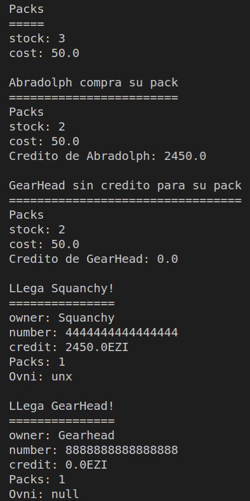
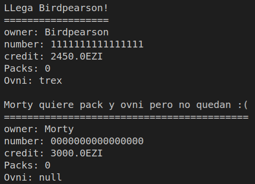

Ricksy Business
===============

El proyecto en historia real se define en que cuando llega un invitado a la fiesta de Ricky, se da de alta en el sistema a traves de una tarjeta de crédito.

Se le carga en el impoorte a la tarjeta:

 - El coste del UberOvni de vuelta a casa
 - El coste del pack de bienvenida (Collaxion crystals).

El proyecto en la aplicación se define con el componente de la reserva del Ovni y el componente de la entrega del pack observan si el invitado esta de alta en el sistema y automáticamente se le cargan en la tarjeta los servicios.

 ## Salida de la aplicación

Una vez completado el proyecto:

## Historias de usuario /casos de uso

Las historias de usuario están enunciadas en el script principal `RicksyBusiness.java`

## Diagrama de clases UML

Seguimos el diagrama de clase UML para contruir la apliación:

